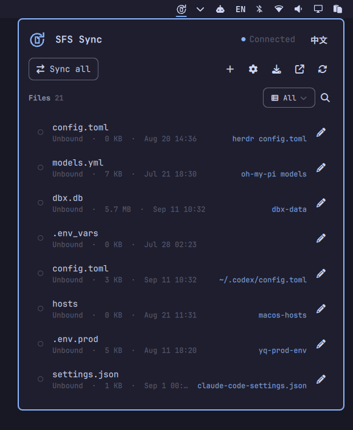

# SFS Sync for Omarchy

A native [Omarchy](https://omarchy.org) bar plugin for [SFS (SmallFileSync)](https://github.com/vst93/sfs): WebDAV sync status in the bar, uploads, downloads, and full syncs from the panel.

**English** · **[中文](#中文说明)**



## Features

- Sync ring on the bar — turns red on conflicts or missing files
- One-click **Sync all** with an outcome summary
- Per-file upload, download, edit, and delete from the panel
- Status filter (All / Linked / Unlinked / Pending) plus text search
- WebDAV settings, connection test, auto-sync toggle
- Share config via an `sfs --import-config` copy
- Auto-starts or reuses the `sfs web` backend, reconnects on its own
- Keyboard driven: `j`/`k` move, `Enter` edit, `x` delete, `s`/`a`/`r`/`w`/`e`/`f` actions
- Bilingual (English / 中文), theme-native colors

## Requirements

- Omarchy (Quattro shell, Hyprland)
- [SFS](https://github.com/vst93/sfs) ≥ 0.1.11 — the plugin talks to `sfs` over its local web API

## Install

```sh
omarchy plugin add https://github.com/vst93/omarchy-sfs.git --enable
```

Left-click the bar icon to open the panel; the backend starts automatically.

If the `sfs` binary is not installed, the panel offers **Install SFS…** — after your confirmation it runs SFS's official install script in a terminal. The script is downloaded from a **pinned commit** and its **SHA-256 is verified before execution**; on any mismatch nothing runs. Omarchy plugins have no install hooks, so this is the one-click path.

## Configuration

Optional, in `~/.config/omarchy/shell.json`:

```jsonc
{
  "io.github.vst93.sfs": {
    "port": 8791,       // sfs web backend port
    "pollSeconds": 30,  // refresh interval (min 10)
    "sfsPath": "sfs",   // binary path if not on $PATH
    "lang": "en"        // "en" | "zh"
  }
}
```

## Remove

```sh
omarchy plugin remove io.github.vst93.sfs
```

The plugin never edits your SFS settings or data.

## Privacy & security

The backend binds to `127.0.0.1` only, and credentials are sent only to the local SFS API. The share command intentionally embeds the password (it is the same `sfs --import-config` blob the SFS app itself shares) — treat it as a secret.

The assisted SFS install never executes code from a moving branch: `cmd/install.sh` is fetched from the immutable commit `1dbc14c876f2adea320dbb132cdcd185d1f0909b` and must match the SHA-256 committed in `Lib.js` (`9fda60e3…50a5d9`) before it is run. A failed download, a missing SHA-256 tool, or a digest mismatch aborts with a non-zero exit and no execution. The pinned installer still fetches the **latest SFS release** at run time, so SFS version bumps need no plugin update; only a change to SFS's own `install.sh` requires re-pinning (run `scripts/update-install-pin.sh` and ship the new plugin commit for review).

## License

[MIT](LICENSE)

---

## 中文说明

[Omarchy](https://omarchy.org) 原生状态栏插件，为 [SFS (SmallFileSync)](https://github.com/vst93/sfs) 提供栏内 WebDAV 同步状态与快捷操作。


### 功能

- 栏内同步环图标，出现冲突或文件缺失时变红
- 一键 **全部同步**，带结果统计
- 面板内单文件上传 / 下载 / 编辑 / 删除
- 状态筛选（全部 / 已关联 / 未关联 / 待同步）+ 关键词搜索
- WebDAV 设置、连接测试、自动同步开关
- 一键复制 `sfs --import-config` 分享命令
- 自动启动或复用 `sfs web` 后端，崩溃后自动重连
- 键盘操作：`j`/`k` 移动、`Enter` 编辑、`x` 删除、`s`/`a`/`r`/`w`/`e`/`f` 快捷动作
- 中英双语，配色跟随 Omarchy 主题

### 安装

```sh
omarchy plugin add https://github.com/vst93/omarchy-sfs.git --enable
```

左键点击栏图标打开面板，后端自动启动。

未安装 `sfs` 时，面板提供 **安装 SFS…**：确认后从**固定提交**下载 SFS 官方安装脚本，先校验 **SHA-256** 再在终端运行；校验不通过则不会执行任何脚本（Omarchy 插件没有安装钩子，这是一键路径）。

### 配置

可选项，写入 `~/.config/omarchy/shell.json`：

```jsonc
{
  "io.github.vst93.sfs": {
    "port": 8791,
    "pollSeconds": 30,
    "sfsPath": "sfs",
    "lang": "en"
  }
}
```

### 卸载

```sh
omarchy plugin remove io.github.vst93.sfs
```

插件不修改 SFS 的任何设置与数据。

### 隐私与安全

后端仅绑定 `127.0.0.1`，凭据只发往本地 SFS API。分享命令内嵌密码（与 SFS 应用的分享格式一致），请当作机密保管。

安装 SFS 时不会执行可变分支上的代码：`cmd/install.sh` 取自不可变提交 `1dbc14c876f2adea320dbb132cdcd185d1f0909b`，且必须与 `Lib.js` 中提交的 SHA-256（`9fda60e3…50a5d9`）完全一致才会运行；下载失败、缺少 SHA-256 工具或校验不符都会非零退出且不执行。固定的只是安装器本身，它在运行时仍会拉取 **SFS 最新版本**，因此 SFS 发新版无需更新插件；只有当 SFS 自己的 `install.sh` 变更时才需要重新固定（运行 `scripts/update-install-pin.sh` 并提交新的插件 commit 送审）。

## 许可

[MIT](LICENSE)
